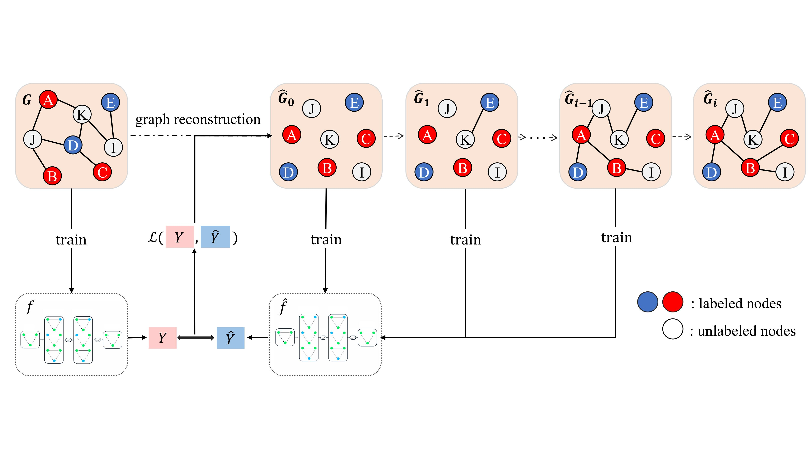

# Safeguarding Graph Neural Networks against Topology Inference Attacks


This repository is the official implementation of the paper "[Safeguarding Graph Neural Networks against Topology Inference Attacks](https://arxiv.org/abs/2509.05429)" accepted by ACM CCS '25.

In this paper, we propose a suite of Topology Inference Attacks (TIAs) that can reconstruct the structure of a target training graph using only black-box access to a GNN model. Our findings show that GNNs are highly susceptible to these attacks, and that existing edge-level differential privacy mechanisms are insufficient as they either fail to mitigate the risk or severely compromise model accuracy. To address this challenge, we introduce Private Graph Reconstruction (PGR), a novel defense framework designed to protect topology privacy while maintaining model accuracy. PGR is formulated as a bi-level optimization problem, where a synthetic training graph is iteratively generated using meta-gradients, and the GNN model is concurrently updated based on the evolving graph. Extensive experiments demonstrate that PGR significantly reduces topology leakage with minimal impact on model accuracy.



## Installation

You need to make sure there are GPU hardware and the CUDA Driver Version: 12.2， CUDA Toolkit Version: 11.6

You can install all requirements with:

```bash
conda create --name PGR python=3.9
conda activate PGR
pip install -r requirements.txt

# Then install them manually
pip install torch==1.13.1+cu116 torchvision==0.14.1+cu116 torchaudio==0.13.1 --extra-index-url https://download.pytorch.org/whl/cu116
pip install torch-scatter==2.1.1 -f https://pytorch-geometric.com/whl/torch-1.13.1+cu116.html
pip install torch-sparse==0.6.16 -f https://pytorch-geometric.com/whl/torch-1.13.1+cu116.html
```

## Code Structure of PGR
* **baseline**: provide the implementation of baselines. 
* **data**: provide data downloading scripts and raw data loader to process original data .
* **graph_reconstruction**: provide the implementation of edge regenerate in PGR.
* **mask**: provide the components of edge regenerate.
* **model**: provide the GNN models.
* **privacy_analyze**: provide the calculation of privacy budget in DP.
* **TIAs**: provide the implementation of C-TIA, M-TIA and I-TIA.
* **utils**: provide graph and adjacency matrix processing functions


## Demo Experiments
You can run the baseline directly with the following default parameters (For example in Table 2):

'Original' means 'No Edge-DP'
```bash
python main.py --attacks TIA --algorithm Original --dataset cora --eps 7
python main.py --attacks TIA --algorithm GAP --dataset cora --eps 7
python main.py --attacks TIA --algorithm LPGNet --dataset cora --eps 7 
python main.py --attacks TIA --algorithm Eclipse --dataset cora --eps 7 
python main.py --attacks TIA --algorithm privGraph --dataset cora --eps 7 
python main.py --attacks TIA --algorithm LapEdge --dataset cora --eps 7  
python main.py --attacks TIA --algorithm EdgeRand --dataset cora --eps 7  

python main.py --attacks TIA --algorithm Original --dataset citeseer --eps 7
python main.py --attacks TIA --algorithm GAP --dataset citeseer --eps 7
python main.py --attacks TIA --algorithm LPGNet --dataset citeseer --eps 7 
python main.py --attacks TIA --algorithm Eclipse --dataset citeseer --eps 7 
python main.py --attacks TIA --algorithm privGraph --dataset citeseer --eps 7 
python main.py --attacks TIA --algorithm LapEdge --dataset citeseer --eps 7  
python main.py --attacks TIA --algorithm EdgeRand --dataset citeseer --eps 7  

python main.py --attacks TIA --algorithm Original --dataset lastfm --eps 7
python main.py --attacks TIA --algorithm GAP --dataset lastfm --eps 7
python main.py --attacks TIA --algorithm LPGNet --dataset lastfm --eps 7 
python main.py --attacks TIA --algorithm Eclipse --dataset lastfm --eps 7 
python main.py --attacks TIA --algorithm privGraph --dataset lastfm --eps 7 
python main.py --attacks TIA --algorithm LapEdge --dataset lastfm --eps 7  
python main.py --attacks TIA --algorithm EdgeRand --dataset lastfm --eps 7  

# you can choose different eps value for Figure 6

For each of the above commands, the command console will finally display the following:
'model accuracy (utility): {xxx} | M-TIA: {xxx} | C-TIA: {xxx} | I-TIA : {xxx}'
```

You can run the PGR directly with the following default parameters on GCN model (For example in Table 3):

```bash
python main.py --attacks TIA --algorithm PGR --dataset cora --prune 0.5 --mu 0.0 --epochs_inner 1 
python main.py --attacks TIA --algorithm PGR --dataset citeseer --prune 0.5 --mu 0.0 --epochs_inner 1 
python main.py --attacks TIA --algorithm PGR --dataset lastfm --prune 0.5 --mu 0.0 --epochs_inner 1

python main.py --attacks TIA --algorithm PGR --dataset cora --prune 0.2 --mu 0.0 --epochs_inner 1 --network GAT
python main.py --attacks TIA --algorithm PGR --dataset citeseer --prune 0.2 --mu 0.0 --epochs_inner 1 --network GAT
python main.py --attacks TIA --algorithm PGR --dataset emory --prune 0.05 --mu 0.0 --epochs_inner 1 -- epochs 200 --network GAT

python main.py --attacks TIA --algorithm PGR --dataset cora --prune 0.2 --mu 0.0 --epochs_inner 1 --network GraphSAGE
python main.py --attacks TIA --algorithm PGR --dataset citeseer --prune 0.2 --mu 0.0 --epochs_inner 1 --network GraphSAGE
python main.py --attacks TIA --algorithm PGR --dataset emory --prune 0.05 --mu 0.0 --epochs_inner 1 --network GraphSAGE

For each of the above commands, the command console will finally display the following:
'model acc loss (utility): {xxx} | M-TIA: {xxx} | C-TIA: {xxx} | I-TIA : {xxx}'
```

## Citation
```bash
@article{fu2025safeguarding,
  title={Safeguarding Graph Neural Networks against Topology Inference Attacks},
  author={Fu, Jie and Yuan, Hong and Chen, Zhili and Wang, Wendy Hui},
  journal={arXiv preprint arXiv:2509.05429},
  year={2025}
}
```
